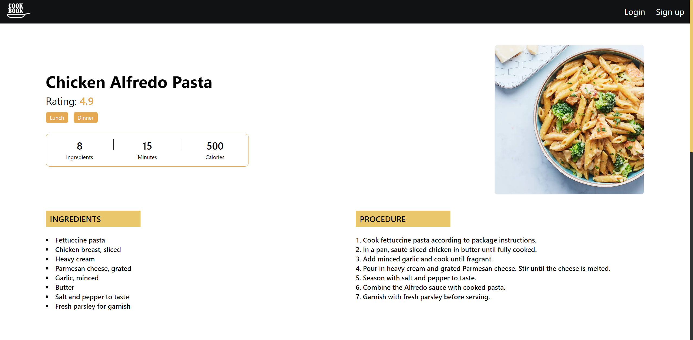

# Recipe-Finder

This repository contains **Recipe-Finder**, a web application that allows users to explore a wide variety of recipes through an intuitive and user-friendly interface. The application integrates with external APIs to fetch recipe data, and also includes user authentication to personalize the experience. Built using modern web technologies, the site is fully responsive, delivering an optimal experience across all devices.




## Features

- **Recipe Search:** Users can search for recipes by name or keyword, with results fetched dynamically from external APIs.
- **Search by Meal Type:** Filter recipes based on meal types (e.g., breakfast, lunch, dinner), offering tailored suggestions.
- **Tag-Based Search:** Browse recipes by tags, making it easier to discover new dishes based on preferences.
- **User Authentication:** The website supports user login and authentication, allowing users to save preferences or track their activity. Authentication and data management are handled via the [DummyJSON API](https://dummyjson.com).
- **Detailed Recipe View:** Each recipe includes detailed information such as ingredients, preparation steps, preparation time, and calorie count per serving.
- **Responsive Design:** The website is optimized for all screen sizes, ensuring a seamless experience on mobile, tablet, and desktop devices.

## API Integration

The Recipe-Finder app fetches all recipe data and user authentication details from the [DummyJSON API](https://dummyjson.com). The API allows the site to retrieve up-to-date recipe information, and securely authenticate users to provide personalized content.

## Technologies Used

- **React:** A powerful JavaScript library for building interactive user interfaces.
- **Vite:** A fast build tool that provides a smooth development experience with optimized builds.
- **Tailwind CSS:** Utility-first CSS framework used for quick and easy design with a focus on responsiveness.
- **React Router:** Manages navigation and URL routing for smooth transitions between pages.
- **React Hooks:** Utilizes hooks like `useState`, `useEffect`, and `useContext` to manage state and side effects within the app.
- **API Integration:** Uses Axios for fetching data from the DummyJSON API to get recipes and user information.
- **Authentication:** Implements login functionality using the DummyJSON API's user data, allowing users to log in securely and access personalized content.
- **ESLint:** Ensures code quality and consistency throughout the project.

## Installation

To run this project locally, follow these steps:

1. **Clone the Repository:**

   ```bash
   git clone https://github.com/ahmedkamal14/Recipe-Finder.git
   cd Recipe-Finder

2. **Install Dependencies:**

   ```bash
   npm install
   
3. **Run the Development Server:**

    ```bash
    npm run dev

## API Configuration:

The application fetches data from [DummyJSON](https://dummyjson.com). No further configuration is required for development since the API is publicly accessible.

## How It Works

- **API Integration:** The app uses the DummyJSON API to fetch recipes and user data. This enables dynamic recipe search and user authentication for login functionality.
- **Search Functionality:** Users can search for recipes using keywords, filter by meal types, or explore by tags. The app fetches search results dynamically based on the input.
- **User Authentication:** The login functionality ensures that users can securely log in, with the app fetching their authentication data from the DummyJSON API. Once logged in, users can see personalized content.
- **Responsive Design:** The layout adapts seamlessly across devices, ensuring an optimal experience whether on a mobile phone or a desktop computer.

## Deployment

This project is deployed on GitHub Pages. You can view the live site at: [Recipe-Finder](https://ahmedkamal14.github.io/Recipe-Finder/).

## Contribution

Contributions are welcome! Feel free to fork this repository, submit issues, or create pull requests. All feedback and improvements are appreciated.
